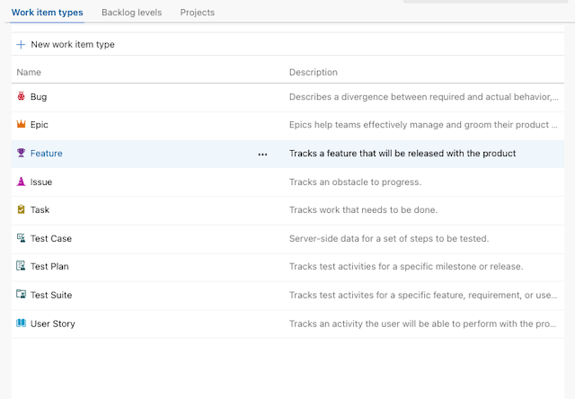

# Multi-value-control

The Multi-Value Control Azure DevOps Extension enhances work item forms by enabling the selection of multiple values within a single field. This functionality is ideal for scenarios requiring categorization under multiple tags.

# Documentation

> Currently only available on TFS 2017 or later and Azure DevOps.

## How to get started
To use the Multivalue control you need a work item field to store the data used by the control and then add the Multivalue control to the form, linking it to the underlying field.

### Create a work item field
You can setup the control to either use a picklist or a semi-colon separate list of values as the domain values for the control.

> Note: the string field in Azure DevOps can maximum store 255 characters. If you have a large number of items in your list then use an HTML field (Text (multiple lines)) instead.

#### Adding a picklist field

* Add a picklist(string) field and add the picklist items in the field definition.

  

* In the option section, select "Allow users to enter their own value"

  

#### Adding a string field

* Add a Text field (use multi line if you need more that 255 characters to store the selected items)

  

### Add a Multi Value control to the work item form
When you have created the work item field to store the value for the Multivalue control you can add the control to the form and link it to the underlying field.

* Navigate to Project Settings and select Process. From there, choose the work item type to which you would like to add a custom field

  

* Select the customization page and add a multivalue control to the form.

  

* Select the field for the control and choose the appropriate values for the control.

  If you use a picklist field:

  

  If you use a string field then also configure the values for the control as a semi-colon separated list in the control definition.

  

## XML process template

To define the layout for a work item type using XML, you'll need to add the Multivalue control to your layout

[Learn more](https://github.com/Microsoft/vsts-extension-multivalue-control/blob/master/xmldetails.md) about how to customize the multivalue control directly on XML.

# How to query

The selected values are stored in a semicolon separated format. To search for items that have a specific value use the "Contains Words" operator. If searching for multiple values, use multipe "Contains Words" clauses for that field.

You can also learn how to build your own custom control extension for the work item form [here](https://www.visualstudio.com/en-us/docs/integrate/extensions/develop/custom-control).

# Support

## How to file issues and get help

This project uses [GitHub Issues](https://github.com/Microsoft/vsts-extension-multivalue-control/issues) to track bugs and feature requests. Please search the existing issues before filing new issues to avoid duplicates. For new issues, file your bug or feature request as a new Issue.

## Microsoft Support Policy

Support for this project is limited to the resources listed above.