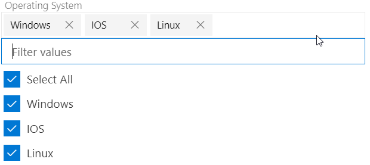
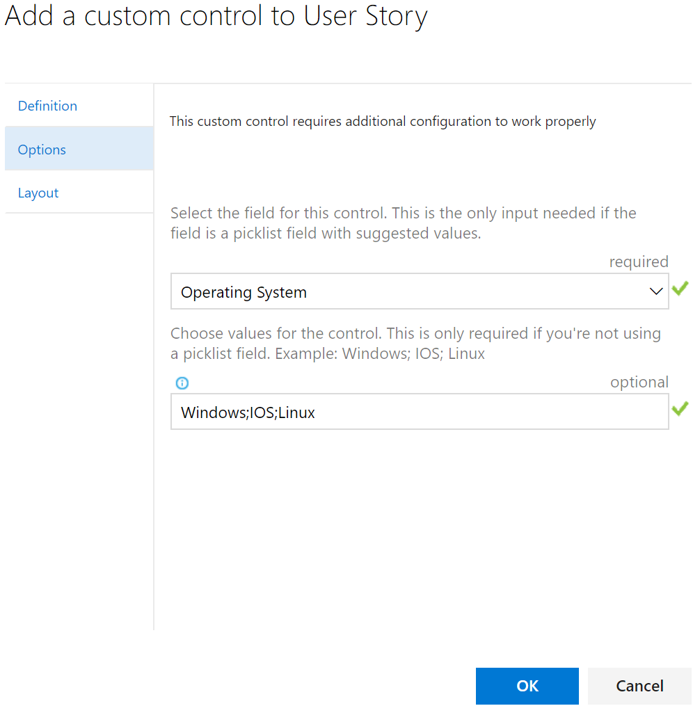

> Currently only available on TFS "15" or later and Visual Studio Team Services. 

# Select multiple values for your fields

# Expand the control only when needed

# How to get started
## Visual Studio Team Services

Navigate to your work item form customization page and add a multivalue control.

Edit the control so it can use the right field to store your selection and the right set of values to be displayed.

## TFS On-Premise
We recommend TFS 15 RC2 and higher when running this extension.

[Learn more](https://github.com/Microsoft/vsts-extension-multivalue-control/blob/master/xmldetails.md) about how to customize the multivalue control directly on XML.

# How to query

The selected values are stored in a semicolon separated format.  To search for items that have a specific value use the "Contains Words" operator.  If searching for multiple values, use multipe "Contains Words" clauses for that field.

# Source code 

The [source](https://github.com/Microsoft/vsts-extension-multivalue-control) for this extension can be found on Github - feel free to take, fork and extend. 

You can also learn how to build your own custom control extension for the work item form [here](https://www.visualstudio.com/en-us/docs/integrate/extensions/develop/custom-control). 

# Feedback 

We appreciate your feedback! Here are some ways to connect with us:

* Add a review.
* Report issues in [GitHub](https://github.com/Microsoft/vsts-extension-multivalue-control/issues).

> Microsoft DevLabs is an outlet for experiments from Microsoft, experiments that represent some of the latest ideas around developer tools. Solutions in this category are designed for broad usage, and you are encouraged to use and provide feedback on them; however, these extensions are not supported nor are any commitments made as to their longevity.
